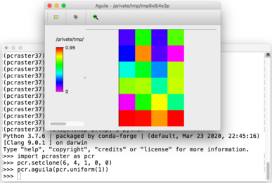

Installing PCRaster with Conda
==============================

PCRaster is available on |condaforgefeedstocksurl| and can be installed using conda.
Supported platforms are Linux, macOS and Windows.
On the Apple M1 platform our osx-64 version can be used, see below.

Prerequisites
-------------

We recommend to download and install |miniconda|.
The user guide and short reference on Conda can be found |minicondadoc|.

Installing PCRaster
-------------------

After setting up Conda you can create a new environment and install PCRaster.

To only install the latest PCRaster version use:

.. code-block:: console

   conda create --name pcraster -c conda-forge pcraster

For installing PCRaster including additional software packages used in our `on-site <https://www.uu.nl/staff/DJKarssenberg/Teaching>`_ or `online <https://pcraster.geo.uu.nl/pcraster_courses/how-to-subscribe/>`_ courses, type:

.. code-block:: console

   conda create --name pcraster -c conda-forge python=3.9 numpy matplotlib pcraster campo spyder qgis spotpy

Always use the conda-forge channel when installing further packages into your PCRaster environment.

.. note::
   If you installed previous versions of PCRaster (4.2 or older) you must remove their entries from the PATH and PYTHONPATH environment variables before activating your environment.
   Modifying PATH and PYTHONPATH environment variables as required for previous PCRaster versions is not necessary anymore starting from version 4.3, the settings are done automatically when you activate your environment.

Installing on Apple silicon (M series)
--------------------------------------

We do not have a native build yet for the Apple M platform but our osx-64 version can be used.
Install |miniconda| using `Miniconda3 macOS Apple M1 64-bit bash`.
Specify the osx-64 channel when creating and installing packages into a PCRaster environment, e.g.:

.. code-block:: console

   conda create --name pcraster -c conda-forge/osx-64 python=3.9 numpy matplotlib pcraster campo spyder qgis spotpy

To allow displaying the visualisation tool Aguila it is required to set an additional environment variable after activating your environment:

.. code-block:: console

   $ conda activate pcraster
   (pcraster) $ export QT_MAC_WANTS_LAYER=1

Testing your installation
-------------------------

You can execute a few basic steps to check if PCRaster works properly in your conda environment.
In case you have not done yet, activate your PCRaster environment.
Then you can test the visualisation tool Aguila by starting it from the command prompt. It will show its help page.
Afterwards start Python:

.. code-block:: console

   $ conda activate pcraster
   (pcraster) $ aguila -h
   (pcraster) $ python

Import the PCRaster module, print the version number and afterwards create a raster with 6 rows, 4 columns, cell length 1 and 0, 0 as origin.
Fill the entire raster with random values drawn from a uniform distribution and display the result:

.. code-block:: python

   import pcraster as pcr

   pcr.__version__
   pcr.setclone(6, 4, 1, 0, 0)
   pcr.aguila(pcr.uniform(1))

You will see that Aguila is displaying the map:

You can also test the PCRaster command line applications.
Exit the Python interpreter and type ``pcrcalc``.
The usage information will be shown:

.. code-block:: console

   (pcraster) $ pcrcalc
   pcrcalc 4.3.3 (linux/x86_64)
    USAGE: pcrcalc [options] "expression"
    or     pcrcalc [options] -f scriptFile
     ( or #!: pcrcalc -F [options]+)
    other flags:
     s #  : set seed (integer > 0) for random generator
            default is based on current time
     b f  : overrule script bindings
     1    : update timeseries files at end of each timestep
     r f  : set run directory
     d f  : debug mode, check MV creation on assignment
             comparing against clone or areamap boolean mask
     c    : strict Case significant filename check (Unix portability)
     p    : print profile information
     m    : optimize with areamap MV compression
     l    : use less memory but more temporary disk storage
     t    : test argument substitution

Troubleshooting
---------------

Aguila fails to start on macOS
~~~~~~~~~~~~~~~~~~~~~~~~~~~~~~

On newer macOS versions Aguila may fail to start up.
This should be resolved by adding the following environment variable:

.. code-block:: console

    export QT_MAC_WANTS_LAYER=1

Import of the ``pcraster`` module fails
~~~~~~~~~~~~~~~~~~~~~~~~~~~~~~~~~~~~~~~

An error message such as

.. code-block:: console

    Traceback (most recent call last):
      File "C:\Software\pcraster\pcraster-4.2.1\python\pcraster\__init__.py", line 21, in <module>
        from ._pcraster import *
    ImportError: DLL load failed while importing _pcraster: Kan opgegeven module niet vinden.

    During handling of the above exception, another exception occurred:

    Traceback (most recent call last):
      File "C:\script.py", line 1, in <module>
        import pcraster as pcr
      File "C:\Software\pcraster\pcraster-4.2.1\python\pcraster\__init__.py", line 55, in <module>
        raise ImportError(msg)
    ImportError: The 'pcraster' module was built for Python 3.6, the version used is 3.8

indicates that an older version of PCRaster is available on the system, here located at ``C:\Software\pcraster\pcraster-4.2.1``.
You need to remove the corresponding PCRaster entries of the PATH and PYTHONPATH environment variables.
After starting a new terminal you can import the ``pcraster`` module.

.. |miniconda| raw:: html

   <a href="https://docs.conda.io/en/latest/miniconda.html" target="_blank">Miniconda</a>

.. |minicondadoc| raw:: html

   <a href="https://docs.conda.io/projects/conda/en/latest/user-guide/cheatsheet.html" target="_blank">here</a>

.. |condaforgefeedstocksurl| raw:: html

   <a href="https://conda-forge.org/feedstock-outputs/index.html" target="_blank">conda-forge</a>
