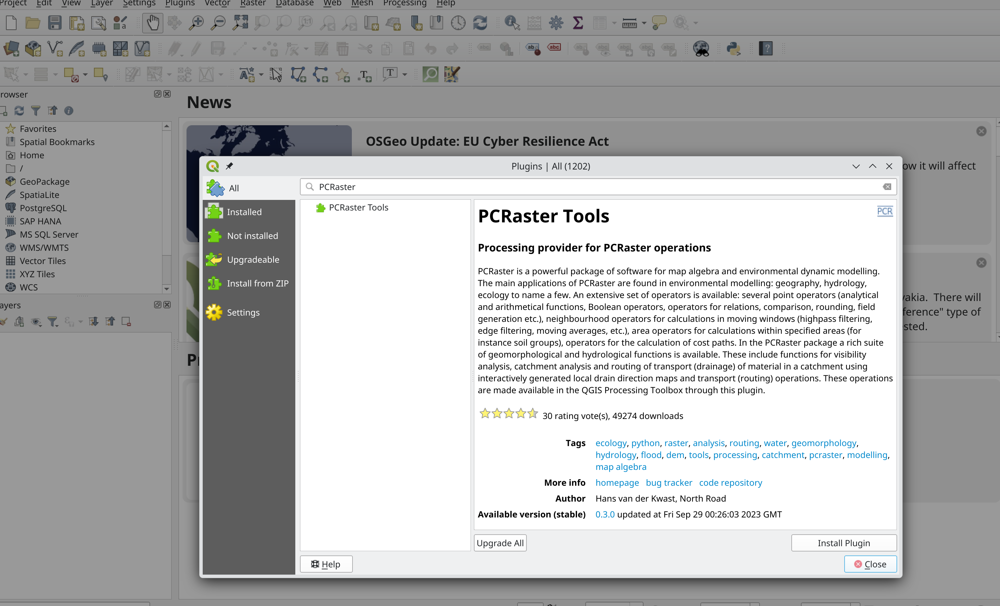

PCRaster and QGIS
=================

You can also use PCRaster within `QGIS <https://qgis.org/en/site/>`_ by additionally installing the `PCRaster Tools Plugin <https://plugins.qgis.org/plugins/pcraster_tools/#plugin-details>`_. You can find further information, installation instructions and videos `here <https://jvdkwast.github.io/qgis-processing-pcraster/>`_.

